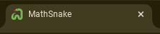
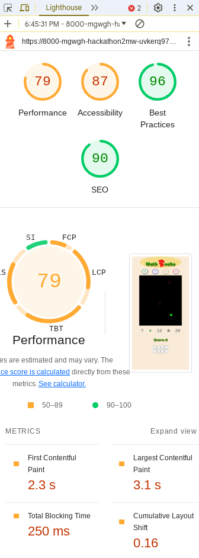
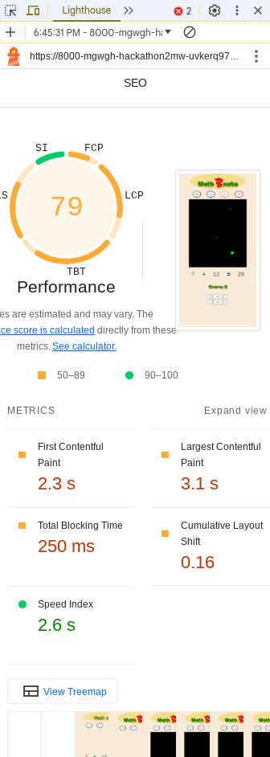
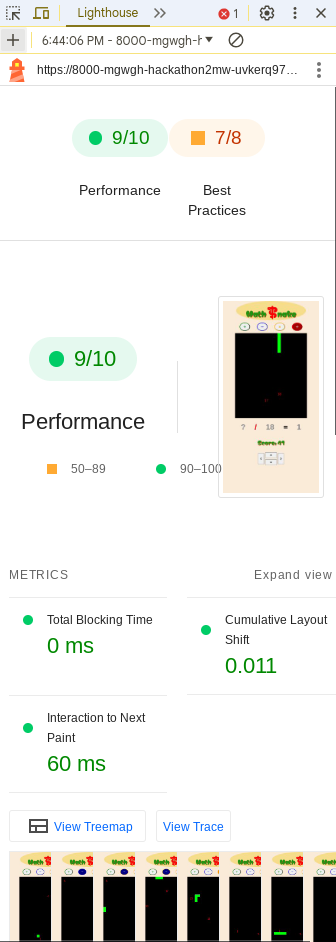
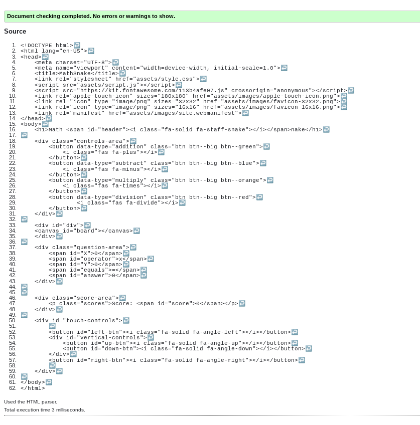
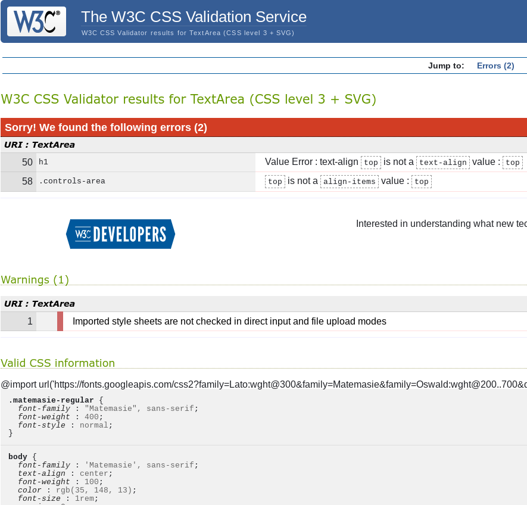
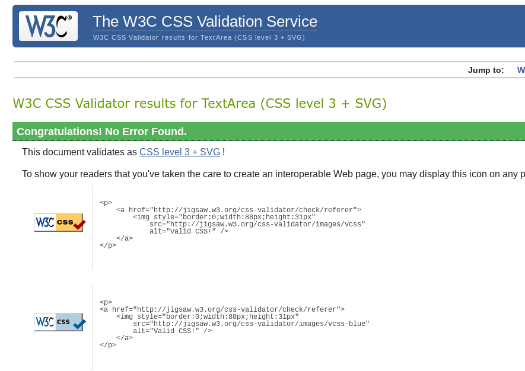
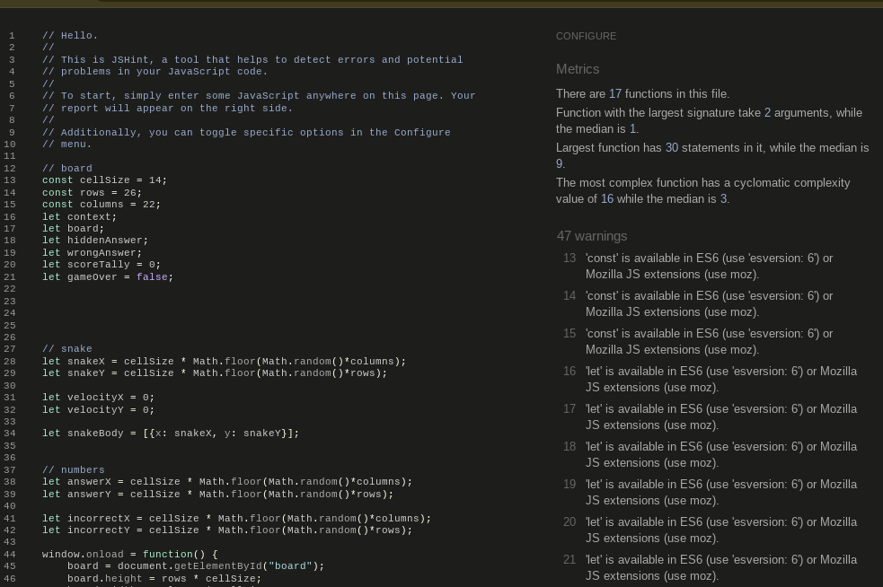

# MathSnake 
## Matt W

MathSnake is an interactive webpage combining the classic snake game with an added maths element to create an effective and fun maths brain training game.

The live link can be found here - https://mgw-gh.github.io/Hackathon2MW/

## Features 

Detailing the existing and planned features and the value they bring.

### Existing Features

- __Favicon__
  
  - The favicon depicts a snake and see on the windows tab. It makes the web page more attractive to users.
  

- __Operator Buttons__

  - The operator buttons allow the user to choose which type of sum they want and indicates the operator that's been chosen by highlighting.
  - Simple and effective design that draws the user into interacting with the page.

- __Canvas (Snake Board)__

  - The canvas is created so the game can be played/drawn on top of it acting as the board that the snake will travel on.
  - Good contrast of colors makes it easy to see all the pipeces drawn on the canvas.
  - Good contrast to the remainder of the body, clearly visible where the board starts and stops.
  - 

- __Equation__ 

  - The equation appears in the form 'X (operator chosen) Y = Z' with one of the elements replaced by a '?' and the corresponsding answer, as well as one incorrect answer, are randomly placed on the canvas.
  - When either of the answers are eaten a new equation will generate with the same operator as before.
  - The operator will change when a different one is selected above.

- __Score__

  - The score appears below the equation is updated as the game is played.
  - Good color scheme linking it the header.
  - Calculated to get exponentially bigger as more correct answers are consumed.

- __Direction control__

  - A change direction function is used to allow the user to control the direction of the snake without it being able to go in the opposite direction.
  - The snake can be controlled by touch using the arrow buttons or by using arrows on a keyboard.
  - This makes the game viable for users of any device.

 

- __Snake Growth__
- Functionality that increases the size of the snake when the correct answer is eaten.

### Features Left to Implement

- __Score erosion__

  - Include function to reduce score when eating the wrong answer.

- __Enemy Snake__
  - Create a function where eating the wrong answer generates a snake which increases in size as more wrong answers are eaten.
  - This will need to include functionality to change direction when the real snake changes direction and the new direction will be randomly generated.
  - Add a game over function which runs if there is some specific form of contact between the snakes.
  
- __Walls__
  - Include a function that also runs a game over function when the snake's head leaves the canvas.
  
- __Head-on-Snake__
  - Include functionality so the game over fucntion is also called if the snake's head comes into contact with intself.

## UX/UI

- __UX__

  The site will be presented as fun and engaging. Users can choose their preferred mathematical operator which will generate an equation. The board in central drawing the user in to play the game. A score is provided and easily seen whilst playing, with direction buttons below for ease of use to mobiles users.

- __User Stories__

  - As a user of this website, I want to easily be able to play the game.
  - As a user, I want to see my score as I play.
  - As a user, I want the game to work as anticipated.
  - As a user, I want to be able to see the content of the game clearly.
  - As a user, I want the game to have a game over scenario.
  - As a user, I want to be able to use touch to control the game directions.
  - As a user, I want the game to fit my device screen.
  - As the product owner, I want the game to work as expected.

- __Wireframes__

  

## Testing 

- __Lighthouse__
  - The lighthouse test is used to give a score for performance, SEO, accessibility and best practices.
  
  

  - Returned scores of 74, 91, 91 & 100 respectively meaning the performance could be improved as our hero image takes 7.8 secs to load.

  

  - You can use the timeframe option to test the performance whilst the game is being played.
  
  

### Validator Testing 

- HTML
  - No errors were returned when passing through the official [W3C html validator] 
  
  

- CSS
  - 2 errors were found and just 1 warning when passing through the official [W3C Jigsaw validator]

  - Updated CSS with no errors

- JavaScript
  
  - 47 warnings were found when passing the js code through Hint, but 0 errors [JS Hint]

## Deployment

This section describes the process we went through to deploy the project to GitHub.

- The site was deployed to GitHub pages. The steps to deploy are as follows: 
  - In the GitHub repository, navigate to the Settings tab 
  - From the source section drop-down menu, select the Master Branch
  - Once the master branch has been selected, the page will be automatically refreshed with a detailed ribbon display to indicate the successful deployment. 

The live link can be found here - https://mgw-gh.github.io/Hackathon2MW/

## Credits 

This section will reference any code used from other repositories as well citation for all images and text taken from other websites. 

### Content 

- parts of the html, css and javascript code for the canvas and game functionality were taken from YouTube (https://www.youtube.com/watch?v=baBq5GAL0_U)
- Parts of the html, css and javascript code for the operator buttons was taken from Code Institute GitHub repo (https://github.com/Code-Institute-Org/love-maths)
- Code implemented to problem solve responsivesness taken from chatGPT (https://chatgpt.com/)
- The text font used was from Google fonts (https://fonts.google.com/)

### Media

- The icon used for the favicon was taken from favicon (https://favicon.io/) 
- The icon used for the S in the header was taken from fontawesome (https://fontawesome.com/)