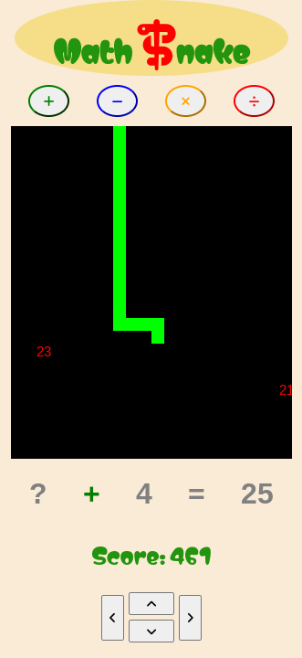
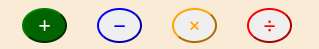
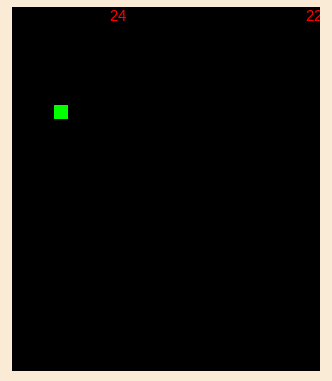
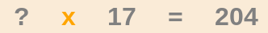
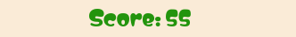
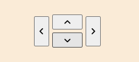

# MathSnake 
## Matt W

MathSnake is an interactive webpage combining the classic snake game with an added maths element to create an effective and fun maths brain training game.

## Features 

Detailing the existing and planned features and the value they bring.

### Existing Features

- __Operator Buttons__

  - The operator buttons allow the user to choose which type of sum they want and indicates the operator that's been chosen by highlighting.
  - Simple and effective design that draws the user into interacting with the page.

- __Canvas (Snake Board)__

  - The canvas is created so the game can be played/drawn on top of it acting as the board that the snake will travel on.
  - Good contrast of colors makes it easy to see all the pipeces drawn on the canvas.
  - Good contrast to the remainder of the body, clearly visible where the board starts and stops.
  - 

- __Equation__ 

  - The equation appears in the form 'X (operator chosen) Y = Z' with one of the elements replaced by a '?' and the corresponsding answer, as well as one incorrect answer, are randomly placed on the canvas.
  - When either of the answers are eaten a new equation will generate with the same operator as before.
  - The operator will change when a different one is selected above.

- __Score__

  - The score appears below the equation is updated as the game is played.
  - Good color scheme linking it the header.
  - Calculated to get exponentially bigger as more correct answers are consumed.

- __Direction control__

  - A change direction function is used to allow the user to control the direction of the snake without it being able to go in the opposite direction.
  - The snake can be controlled by touch using the arrow buttons or by using arrows on a keyboard.
  - This makes the game viable for users of any device.

 

- __Snake Growth__
- Functionality that increases the size of the snake when the correct answer is eaten.

### Features Left to Implement

- __Score erosion__

  - Include function to reduce score when eating the wrong answer.

- __Enemy Snake__
  - Create a function where eating the wrong answer generates a snake which increases in size as more wrong answers are eaten.
  - This will need to include functionality to change direction when the real snake changes direction and the new direction will be randomly generated.
  - Add a game over function which runs if there is some specific form of contact between the snakes.
  
- __Walls__
  - Include a function that also runs a game over function when the snake's head leaves the canvas.
  
- __Head-on-Snake__
  - Include functionality so the game over fucntion is also called if the snake's head comes into contact with intself.

## UX/UI

- __UX__

  The site will be presented as simple but attractive and easy to navigate. Users can find their preferred cuisine with some culinary history and a recipe to follow. Users who want further interaction can leave a review or subscribe to receive monthly comms with new recipes based on their favourite cuisine.

- __User Stories__

  - As a user of this website, I want to easily navigate to my desired cuisine without scrolling down the whole page.
  - As a user, I want to find new recipes that I can cook at home.
  - As a user, I want to know which page I'm on so it's easier to navigate.
  - As a user, I want to be able to read the content easily so that I understand and like visiting the site.
  - As a user, I want to be able to follow links to more receipes based on my preferred cuisine.
  - As a user, I want to see pictures of the receipes so I can see what I'm going to cook.
  - As a user, I want to see vegetarian options so that I can use the recipes for vegetarians.
  - As the product owner, I want to be able to add and remove receipes so the site is constantly updating and giving the user more value.
  - As the product owner, I would like the site to be responsive to all devices small to large so that the uer has the best experience regardless of device.
  - As the product owner, I would like to receive feedback from users so we can update the site for improved user experience.

- __Wireframes__

  

## Testing 

- __iPad view__

- __Lighthouse__
  - The lighthouse test is used to give a score for performance, SEO, accessibility and best practices.
  - We returned scores of 74, 91, 91 & 100 respectively meaning the performance could be improved as our hero image takes 7.8 secs to load.
  

### Validator Testing 

- HTML
  - No errors were returned when passing through the official [W3C validator] 
- CSS
  - No errors were found but 16 warnings when passing through the official [(Jigsaw) validator]

## Deployment

This section describes the process we went through to deploy the project to GitHub.

- The site was deployed to GitHub pages. The steps to deploy are as follows: 
  - In the GitHub repository, navigate to the Settings tab 
  - From the source section drop-down menu, select the Master Branch
  - Once the master branch has been selected, the page will be automatically refreshed with a detailed ribbon display to indicate the successful deployment. 

The live link can be found here - https://code-institute-org.github.io/love-running-2.0/index.html 

## Credits 

This section will reference any code used from other repositories as well citation for all images and text taken from other websites. 

### Content 

- The intro text on all the countries was modified from chatGPT (https://chatgpt.com/)
- The borsch recipe was taken from BBC Good Food (https://www.bbcgoodfood.com)
- The varanyky recipe was taken from (https://www.recipesfromeurope.com/varenyky/)
- The moroccan receipes were taken from (https://www.thespruceeats.com/)
- The CDN framework used for ready made styling was Bootstrap 5 (https://getbootstrap.com/docs/5.0/getting-started/download/)
- The fonts that have been imported are from Google fonts (https://fonts.google.com/)
- The icons in the footer were taken from [Font Awesome](https://fontawesome.com/)

### Media

- The image for the header background was taken from Google images (https://images.google.co.uk/) 
- The main background colour gradient was taken from Web Gradients (https://webgradients.com/)
- The colour gradient used on the cuisine pages' title was taken from CS Gradient (https://cssgradient.io/blog/css-gradient-text/)
- The images on the Ukrainian and Moroccan pages were taken/made from firefly (https://firefly.adobe.com/inspire/images)
- The ramen image for the Japanese page was taken from the NY times (https://cooking.nytimes.com/recipes/1024748-shoyu-ramen)
- The curry rice image for the Japanese page was taken from Just One Cook Book (https://www.justonecookbook.com/simple-chicken-curry/)